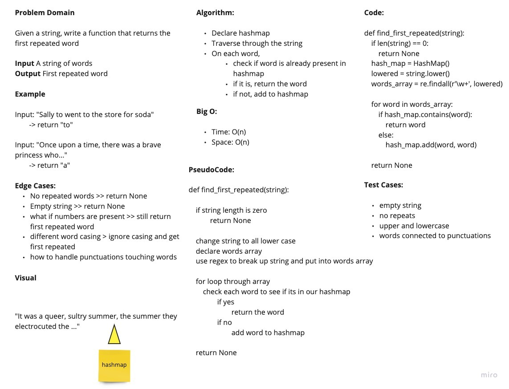

# Hashmap Repeated Word Code Challenge
<!-- Description of the challenge -->
Write a function called repeated word that finds the first word to occur more than once in a string

## Whiteboard Process
<!-- Embedded whiteboard image -->

## Feature Tasks

- Write a function called repeated word that finds the first word to occur more than once in a string
- Arguments: string
- Return: string

## Collaborations

Daniel, Wondwosen and Davee
